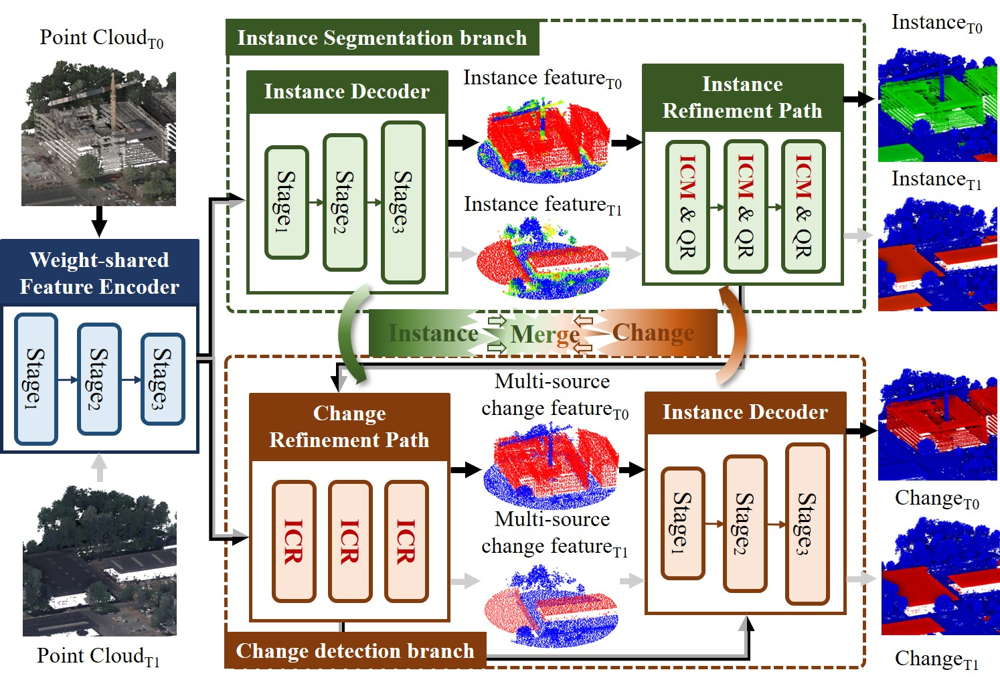

# MSENet

         

# Overview
To address the end-to-end 3D instance change detection, we propose a Multi-task Synergistic Enhancement Network, named MSENet, which is an end-to-end 3D instance change detection method and deeply couples instance segmentation and change detection within a unified architecture. It is composed of an instance segmentation branch and a change detection branch. The instance segmentation branch incorporates an instance cluster mask (ICM) module to implicitly embed change information, enabling precise instance mask segmentation through a clustering-guided feature fusion. The change detection branch uses an instance-oriented change refinement (ICR) module to detect changes of the target instances and suppress the effects of changes in background non-instance objects by fusing multi-source features.
