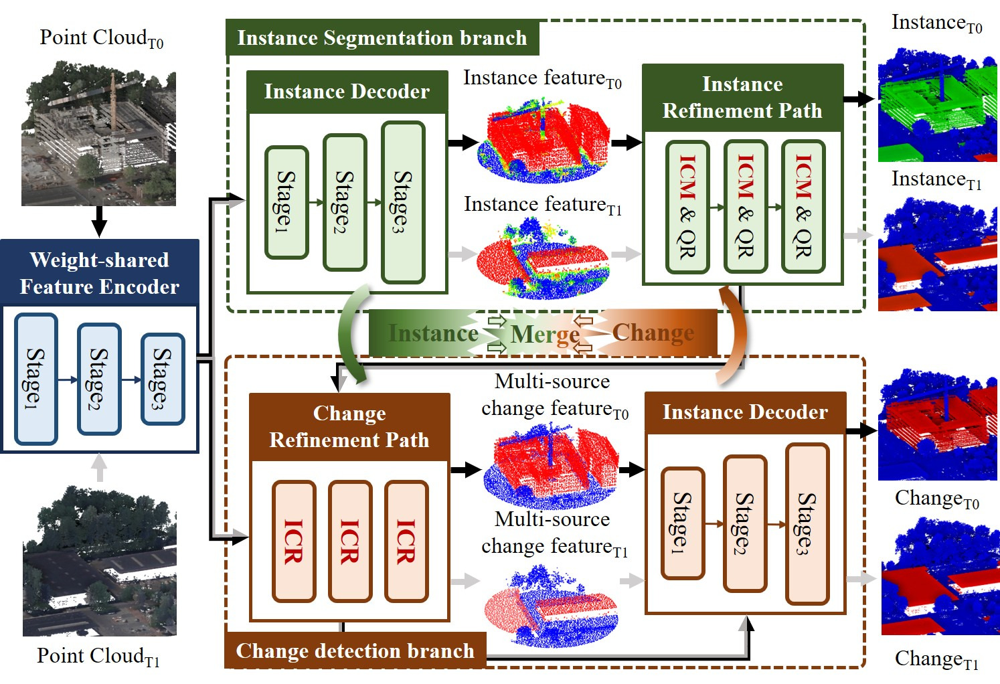

# MSENet
<p align="center">
         
</p>

# Overview
To address the end-to-end 3D instance change detection, we propose a Multi-task Synergistic Enhancement Network, named MSENet, which is an end-to-end 3D instance change detection method and deeply couples instance segmentation and change detection within a unified architecture. It is composed of an instance segmentation branch and a change detection branch. The instance segmentation branch incorporates an instance cluster mask (ICM) module to implicitly embed change information, enabling precise instance mask segmentation through a clustering-guided feature fusion. The change detection branch uses an instance-oriented change refinement (ICR) module to detect changes of the target instances and suppress the effects of changes in background non-instance objects by fusing multi-source features.

## Requirements

- CUDA 11.3
- Python 3.8
- PyTorch 1.12.0
- torch-geometric 1.7.2
- torch-points-kernels 0.6.10
- torch-points3d 1.3.0
- torch-scatter 2.1.0
- torch-sparse 0.6.15
- torch-spline-conv 1.2.1

Install with

```bash
pip install -r requirement.txt
```

## Project structure

```bash
├─ benchmark               # Output from various benchmark runs
├─ conf                    # All configurations for training nad evaluation leave there
├─ notebooks               # A collection of notebooks that allow result exploration and network debugging
├─ docker                  # Docker image that can be used for inference or training
├─ docs                    # All the doc
├─ eval.py                 # Eval script
├─ find_neighbour_dist.py  # Script to find optimal #neighbours within neighbour search operations
├─ forward_scripts         # Script that runs a forward pass on possibly non annotated data
├─ outputs                 # All outputs from your runs sorted by date
├─ scripts                 # Some scripts to help manage the project
├─ torch_points3d
    ├─ core                # Core components
    ├─ datasets            # All code related to datasets
    ├─ metrics             # All metrics and trackers
    ├─ models              # All models
    ├─ modules             # Basic modules that can be used in a modular way
    ├─ utils               # Various utils
    └─ visualization       # Visualization
├─ test
└─ train.py                # Main script to launch a training
```

You can find the code of MSENet though "torch_points3d/models/change_detection/MSENet.py"

## Inference

You can train the MSENet by

```bash
python trainSiamKPConv.py
```

You can evaluate the MSENet by

```bash
python eval_SiamKPConv.py
```
